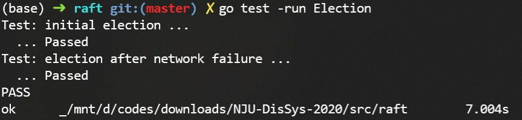
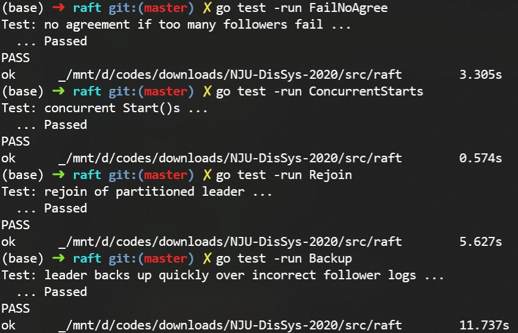
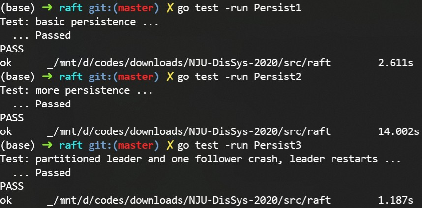
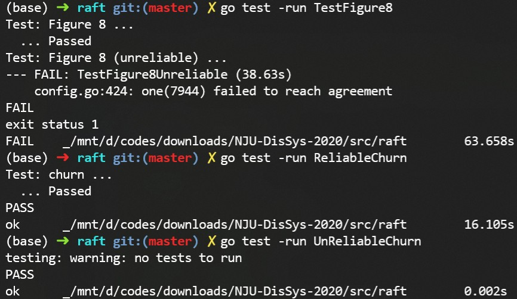

## 分布式系统实验报告

> MF 20330079 王弘毅

***

#### Raft 原理

Raft 是斯坦福大学研究人员为解决 Paxos 难度过高难以理解的问题，开发用于管理日志复制的分布式共识算法。它适用于在不超过半数集群节点崩溃情况下，多节点日志一致问题。

Raft 采用强主模式。集群只有一个选举产生的 Leader，该 Leader 完全负责管理集群其他节点上的日志复制。数据仅在一个方向上流动：从 Leader 流向其他节点。

Raft 的主要特点如下所示。

* 一个 Raft 集群由若干节点组成。节点可能处于以下三种角色中的一种： Leader，Follower，Candidate。职责分别如下：
  
   * **Leader**：负责从客户端处接收新的日志记录，备份到其他节点上，并在日志安全备份后通知其他节点将该日志记录应用到位于其上层的状态机上。
   * **Follower**：总是处于被动状态，接收来自 Leader 和 Candidate 的请求，而自身不会发出任何请求。
   * **Candidate**：作为候选人选举成为 Leader。
* 为了简化算法，Raft 将共识问题分解为三个子问题：
   * **Leader Election (Leader选举)**：如果现有Leader机器故障，则需要选举一名新Leader。
   * **Log replication (日志复制)**：Leader需要通过复制使所有节点的日志与其自己的节点保持同步。
   * **Safety (安全性)**：如果其中一台节点已在特定索引上提交了日志条目，则其他任何节点都不能为该索引应用其他日志条目。
* 为了保证算法达成分布式共识，Raft 确保始终具有以下几个属性：
   * **Election Safety (选举安全)**：在给定的Term中最多只能选举一位Leader。
   * **Leader Append-only (仅追加)**：Leader永远不会覆盖或删除其日志中的条目； 它仅追加新条目。
   * **Log Matching (日志匹配)**：如果两个日志包含具有相同索引和术语的条目，则直到给定索引的所有条目中的日志都是相同的。
   * **Leader Completeness (完整度)**：如果在给定的期限内提交了日志条目，则该条目将出现在Leader的日志中，用于所有编号较高的条款。
   * **State Machine Safety (状态机安全)**：如果节点已将给定索引的日志条目应用于其状态机，则其他节点将永远不会为同一索引应用不同的日志条目。

***

#### 实验1  Leader Election

这部分需要完成 Leader election。

首先按照 Raft 论文中的描述，完成 Raft 各结构体中的内容。

```go
type Raft struct {
  mu    sync.Mutex
  peers   []*labrpc.ClientEnd
  persister *Persister
  me    int // index into peers[]

  CurrentTerm int
  VotedFor  int //-1 for nil
  Log     []Entry
  State    int //0 for Leader; 1 for Follower; 2 for Candidate
  //Volatile state on all servers
  CommitIndex int
  LastApplied int
  //Volatile state on leaders
  NextIndex []int
  MatchIndex []int

  TimeoutTimer  *time.Timer
  ReelectionTimer *time.Timer

  SendHBChan     chan int
  CandidateToFollwer chan int
  LeaderToFollwer  chan int
  commitChan chan int
}
```

```go
type RequestVoteArgs struct {
	Term         int
	CandidateID  int
	LastLogIndex int
	LastLogTerm  int
}
type RequestVoteReply struct {
	Term        int
	VoteGranted bool
}
```

```go
type AppendEntriesArgs struct {
	Term         int
	LeaderID     int
	PrevLogIndex int
	PrevLogTerm  int
	Entries      []Entry
	LeaderCommit int
}
type AppendEntriesReply struct {
	Term      int
	Success   bool
	NextIndex int
}
```

Raft 的第一阶段是选举。定义了一些相关的常量：

```go
const (
	LEADER_STATE      = 0
	FOLLOWER_STATE    = 1
	CANDIDATE_STATE   = 2
	HEARTBEAT_TIME    = 50
	ELECTION_TIME_MIN = 150
	ELECTION_TIME_MAX = 300
	REELECTION_TIME   = 1000
	TIME_UNIT         = time.Millisecond
)
```

为每个集群节点设定了两个定时器`TimeroutTimer`与`ReelectionTimer`。前者作为 Follower 状态时到期转变为 Candidate 的计时器。后者为 Candidate 等待选举结果超时后，发起重新选举的计时器。	

节点的初始化通过调用 `rf.Make()`方法。`rf.Make()`中完成各变量的初始化后，便通过调用一个线程，开启 Raft 节点。

```go
func Make(peers []*labrpc.ClientEnd, me int, persister *Persister, applyCh chan ApplyMsg) *Raft{
    raft struct paramenters initialization
    
    go RaftServerCommit(rf, applyCh)
    go RaftServer(rf)

    return rf
}
```

`RaftServer(rf)`调用后，节点被开启。其中通过`for{}`死循环不断进行状态检查以及相应的操作。在进行各自相应的职责外，Leader 和 Candidate 还要监听本身可能会转变为 Follower 的信号`LeaderTOFollower`与`CandidateTOFollower`。这样的信号来源于：

* 集群出现网络波动，原来的 Leader 断开连接，连接回来后已无法保持 Leader 身份。
* Candidate 在选举中落选，需要变回 Follower。

```go
func RaftServer(rf *Raft){
    for{
        case LEADER_STATE:
        	send HeartBeats
        	send AppendEntries
        
 			monitor LeaderTOFollower
        case FOLLER_STATE:
        	do nothing
        
        	monitor TimeoutTimer to become Candidate
        case CANDIDATE_STATE:
        	initiate an election
                win an election to be Leader or lose
        
        	monitor CandidateTOFollower
        	monitor ReelectionTimer to reinitiate an election
    }
}
```

完成准备工作后，接下来只要实现`RequestVote()`调用。Raft 的选举中，每个节点能且仅能投出一票，流程如下：

* Follower `TimeoutTimer`超时后，转变为 Candidate，给自己投一票。之后向集群其他节点发送`RequestVote()`调用请求投票。

* 其他的 Candidate 收到 `RequestVote()`后，由于已经给自己投了一票，故不会理会该调用；而其他 Follower 收到此调用后，按照以下原则投出在此 Term中的票。

   *  Candidate 的 Term 不小于此 Follower 的 Term
   
   由于实验1还不需要复制日志，因此仅有该原则。Follower 投票按照满足条件的 Candidate，先到先投的原则进行投票。
   
* Raft 采用强主模式，要求某个 Candidate 收到超过半数的票后，方可成为 Leader。

   选出 Leader 后，Leader 开始向集群发送心跳包，完成身份确认。同时心跳包也起到重置 Follower`TimeoutTimer`的作用。

心跳包的发送复用了`AppendEntries()`调用。Leader 端使用一个`heartBeatTicker`的计时器，周期性向`rf.SendHBChan`发送信号，以让 Leader 向集群发送心跳包。由于`Ticker`是周期性产生信号，开销较大，故不作为 raft struct 成员，而是在节点成为 Leader 后开始，在 Leader 节点放弃 Leader地位后关闭。`AppendEntries()`在作为心跳包时流程如下：

* 重置目标节点`TimeoutTimer`计时器。
* 通过`Term`信息更新节点状态：
  * `args.Term < rf.CurrentTerm`：Leader 的 Term 落后于目标节点 Term，目标节点更新 Leader 的 Term。这是由于网络波动导致旧 Leader 断开集群后，集群已完成新一轮选举。故旧 Leader 在接收到回送后，将转变为 Follower。
  * `rf.State == CANDIDATE_STATE && args.Term >= rf.CurrentTerm`：选举结束后，败选者转变为 Follower。
  * `rf.State == LEADER_STATE && args.Term > rf.CurrentTerm`：旧 Leader 接收到了新 Leader 的包，旧 Leader 自己转变为 Follower。


本部分实验均通过，结果如下：



***

#### 实验2 日志复制

这部分需要完成 Leader 接收来自客户端的 Log，然后向集群节点发起备份。在多数节点备份后，将该 Commit 进行确认、将其应用至自己的状态机，并将确认的消息再次发送给集群节点。

客户端的 Log 来源于 `Start()`调用。如果目标节点是 Leader，则向该节点发送一条 Log。在 Raft 协议中，如果与客户端交互的节点不是 Leader，则该节点会将 Leader 节点返回给客户端以使其重定位。但本实验`Start()`调用为向集群轮询发送 Log，故无需实现重定位。

接下来 Leader 通过向集群其他节点调用`AppendEntries()`来进行日志同步。由于 Raft 的日志同步采用的是 Leader 主导同步模式，故一切与 Leader 端不符的日志，都会被删除。Leader 需要为每个节点维护一个`NextIndex`进行同步。`NextIndex`表明了 Leader 为其他节点同步日志的起始点，同时也意味着在`NextIndex`以前的所有日志都已经与 Leader 一致。故通过回溯 Follower 日志 Index 并与 Leader 相应日志比对来更新`NextIndex`。原论文中`NextIndex`的回溯更新是每次向前一步直到一致。为了加速这一过程，本实现中向`AppendEntriesReply struct`中添加了`NextIndex`量。并且基于 Raft 每个任期有且仅有一个 Leader，故回溯的加速方法是每次向前一个任期直到一致。

```go
func (rf *Raft) AppendEntries(args AppendEntriesArgs, reply *AppendEntriesReply){
    prev works
    
    //update NextIndex
    if args.PrevLogIndex >= 0 {
		if rf.Log[args.PrevLogIndex].Term == args.PrevLogTerm {
			rf.Log = rf.Log[:args.PrevLogIndex+1]
			rf.Log = append(rf.Log, args.Entries...)
			rf.persist()
			reply.Success = true
			reply.NextIndex = len(rf.Log) 
		} else {
			localCurrentTerm := rf.CurrentTerm
			for i := args.PrevLogIndex - 1; i >= 0; i++ {
				if rf.Log[i].Term != localCurrentTerm {
					reply.NextIndex = i + 1
					break
				}
			}
			return
		}
	}
}
```

此外`AppendEntries()`完成日志在多数集群备份后的确认。`AppendEntries()`返回的`NextIndex`可用于更新`rf.MatchIndex`。Leader 的`rf.commitIndex`记录了目前集群中日志确认的位置。通过遍历`rf.commitIndex`到`rf.MatchIndex`，为每一条已经被集群多数备份的日志，进行确认。并且激活`rf.commitChan`，然后在`RaftServerCommit()`线程中完成日志确认与向本地状态机提交。

```go
//In Leader State
go func(i int, args AppendEntriesArgs) {
    if ok := rf.peers[i].Call("Raft.AppendEntries", args, &rpcReply); ok {
        if rpcReply.Success {
            if len(args.Entries) > 0 {
                rf.mu.Lock()
                rf.NextIndex[i] = rpcReply.NextIndex
                rf.MatchIndex[i] = rf.NextIndex[i] - 1
                lastCommit := rf.CommitIndex
                for j := rf.CommitIndex + 1; j <= rf.MatchIndex[i]; j++ {
                    commitServerNum := 1
                    for serverIndex := range rf.peers {
                        if serverIndex != rf.me && rf.MatchIndex[serverIndex] >= j {
                            commitServerNum += 1
                        }
                    }
                    if commitServerNum*2 > len(rf.peers) {//major confirmed
                        lastCommit = j
                    }
                }
                if lastCommit != rf.CommitIndex {
                    rf.CommitIndex = lastCommit
                    rf.commitChan <- 1
                }
                rf.mu.Unlock()
            }
        } else {
            rf.NextIndex[i] = rpcReply.NextIndex
        }
    }
}(i, rpcArgs)
```

此外在开启日志复制后，Follower 对于收到`RequestVote()`后投票的原则，也有了新的变化。具体原则如下：

* Candidate 的 Term 不小于此 Follower 的 Term
* Candidate 最大的 Log Index 不小于此 Follower 的 Log Index


本部分实验均通过，结果如下：



***

#### 实验3 集群容错 (可选)

这部分需要完成集群在出现节点崩溃情况下的容错能力。

框架中提供了`rf.persist()`方法来备份节点当前状态。当前节点崩溃恢复时，就会通过备份来进行恢复。因此需要完成两个任务：

* 选出合适的用于备份的信息
* 在合适的位置进行备份

对于 Raft 协议，其最重要的方面便是每个节点的任期与日志，因此选择以下信息进行备份：

* `rf.CurrentTerm`：节点的任期，与选举有关
* `rf.Log`：节点的日志，与备份有关
* `rf.VotedFor`：节点的选票。Raft 基于每个节点投且仅投出一票的前提。

而备份的时机点，则选在了以上信息被更改的时候。在完成更改后，调用`rf.persist()`即可完成备份。


本部分实验均通过，结果如下：




额外实验部分未通过，结果如下：



***

#### 实验总结

* 本实验通过多线程的方式实现了单机 Raft 协议。因此整个实验具有非常强的并发性，这导致调试变得非常困难。在实验中，插入了大量输出信息来观察程序的运行状况。
* 对于 channel 类型的变量，需要完成初始化。不初始化，不会引发语法错误，但会造成向 channel 变量发送信号时，信号无法被接收，造成程序错误。在实验中，忘记了对`rf.CandidateToFollower`与`rf.LeaderToFollower`初始化，导致集群无法正常工作。
* Golang 使用大小写来区分可在外部调用中使用的变量。因此本实验中与`Call()`相关的结构体变量，均要大写。
* Raft 协议中包含了复杂的状态转换。这些状态转换，直观地会用`Label：， goto`的方式来完成。Golang 提供了方便的匿名函数`fun(){}()`功能，合理地将代码块打包成匿名函数，通过`return`的方式，可以快速地完成这样的状态转换，并提高程序可读性。
* Raft 协议中，`Request`与状态变更是通过监听信道的方式来完成的。本实现中，则是通过 channel 变量来进行信息传递。因此模型的设计上要尽可能把监听操作与其他操作（如选举，同步日志操作）分离开，即在不同的线程进行操作。多线程的操作，则会导致许多地方需要加锁-解锁，这部分在实验中也花费了一定时间。